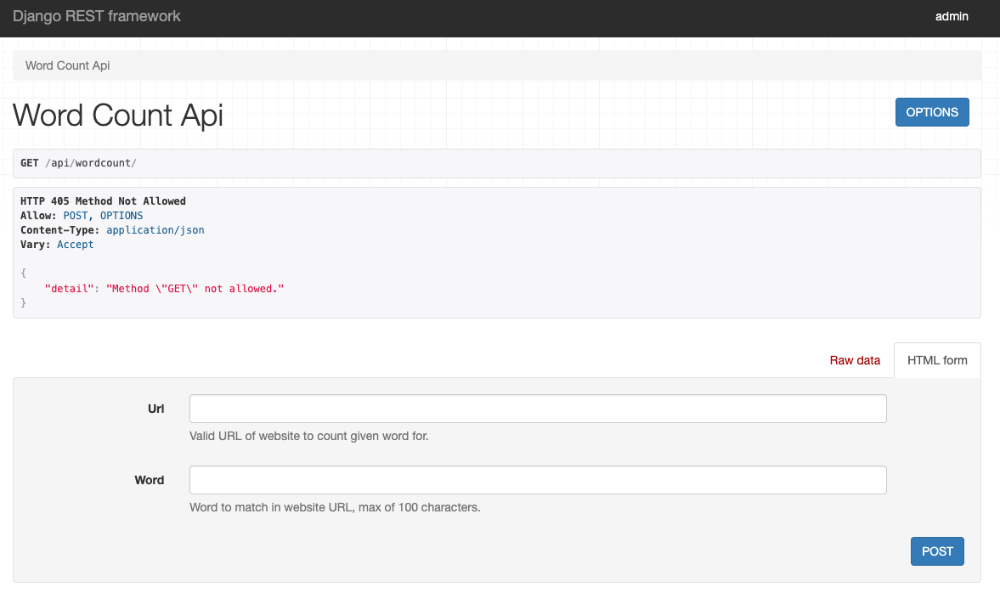

# Site Word Counter API

Simple Django REST Framework Application providing an API endpoint to count the occurrences of the exact match of a word in the content parsed from a given URL using BeautifulSoup. Words containing the word are not included, case-insensitive.

## Endpoint




```
POST http://localhost:8000/api/wordcount/
```

This endpoint takes a URL and a word as input and returns the word and the count of exact match occurrences of the word parsed from the provided URL.

## Request

- Method: `POST`
- Content Type: `application/json`

### Request Body

```json
{
    "url": "https://sitewordcount.com",
    "word": "test"
}
```

### Request Body Parameters

- `url` (string, required): The URL from which to fetch the content.
- `word` (string, required): The word to count in the content.

## Response

### Success Response

- Status Code: `200 OK`

```json
{
    "word": "test"
    "count": 1
}
```

### Error Responses

- Status Code: `400 Bad Request`

```json
{
    "error": "Error message"
}
```

## Dependencies

- Django
- Django REST Framework
- Beautiful Soup
- Requests

## Setup

1. Create a virtualenv
   ```
   python -m venv .venv
   ```

2. Install dependencies:
   ```
   pip install -r requirements.txt
   ```

3. Go inside wordcount project directory
   ```
   cd wordcount
   ```

3. Run migrations:
   ```
   python manage.py migrate wordcount
   ```

4. Run the development server:
   ```
   python manage.py runserver 0.0.0.0:8000
   ```

## Usage

Make a `POST` request to `http://localhost:8000/api/wordcount/` endpoint with the required parameters in the request body to count the occurrences of a word in the page URL.

## Limitations

This application can not handle translations of words in websites, I tried translating with `googletrans` and `translate` packages but to no avail. Would need a better translate API (non-free) to achieve translation.

Word count may include hidden content due to how some websites are made with dropdown menus, hidden elements etc, count may include these so at times it may not match user visible count. I tried trimming these as much as possible but there still might be mismatch in the counts.
